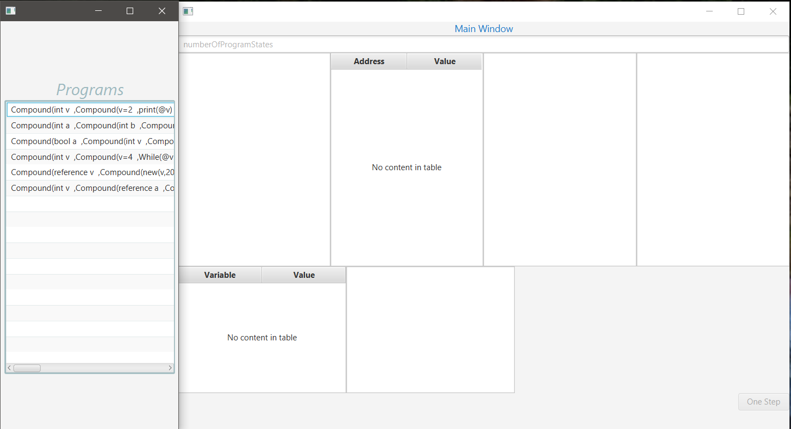
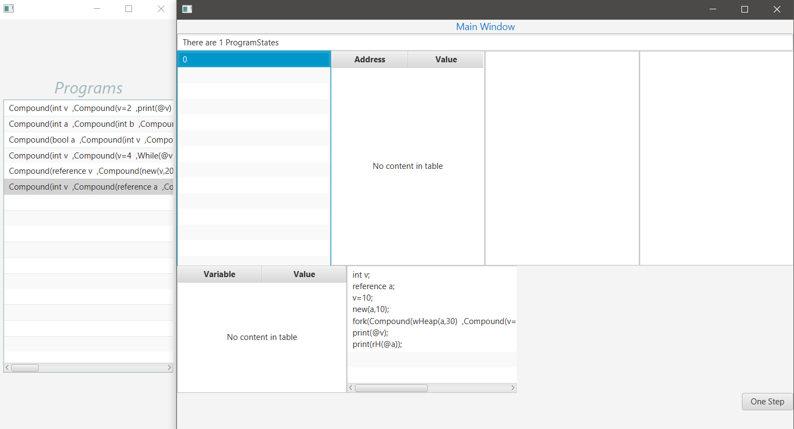
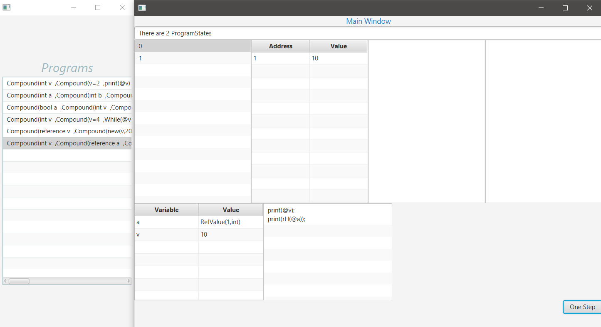
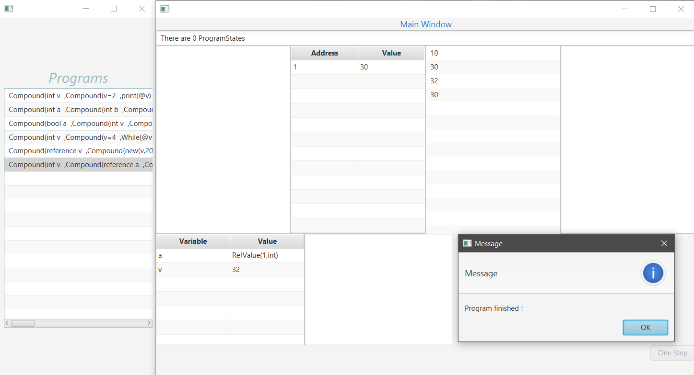

Bellow I added a manual execution where I explain step by step 
what is happening.

This are the two windows at start: on the left the selection of a program 
to run and on the right each state can be viewd in detail: 
-1st box - program states 
-2nd box - heap 
-3rd box - console (prints can be viewd here) 
-4th box - table of variables 
-5th box - statement

After program selection, on the other window the only program state is selected. 
On the bottom all statements can be seen in execution order.

After a fork statement, a new program state is created (simulating different processes) 
and at each step both program states advance one step.

Once the execution is finished, the user is informed with a pop-up window.

